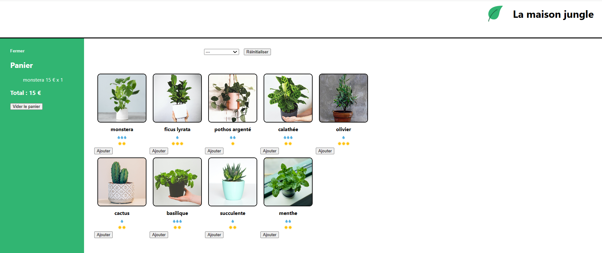

# 🌿 La maison jungle

**La maison jungle** est une mini-application de e-commerce développée avec **React**. Elle permet d'afficher une sélection de plantes, de filtrer selon certains critères, et de gérer un panier d'achat interactif.

## 📸 Aperçu

---

## 🚀 Fonctionnalités

- Affichage d’une liste de plantes avec leurs caractéristiques (prix, eau, lumière).
- Ajout d’une plante au panier.
- Affichage dynamique du contenu du panier (nom, quantité, total).
- Suppression du panier.
- Design simple et responsive.
- Filtrage des plantes par type (optionnel si implémenté).

---

## 🛠️ Technologies utilisées

- [React](https://reactjs.org/)
- HTML / CSS
- JavaScript (ES6+)
- JSX
